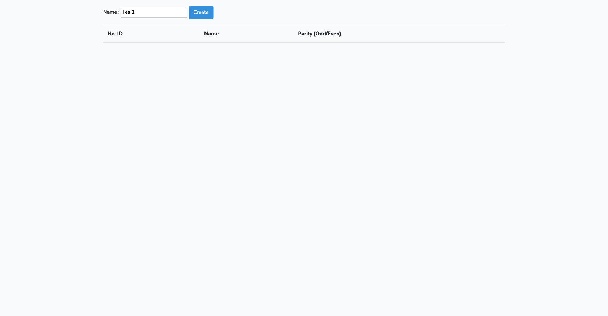
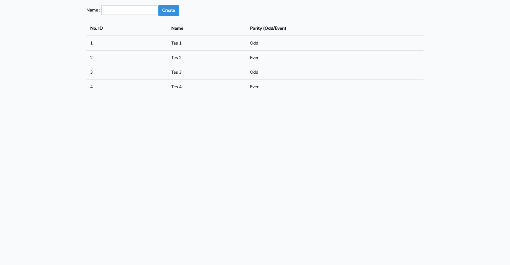

## Tech Stack

## About Test

Tes ini bertujuan untuk memasukkan data user beserta mengecek input tersebut adalah ganjil / genap.

## Requirement

- [SQLite](https://www.sqlite.org/index.html)
- [npm](https://www.npmjs.com/get-npm)
- **[Composer](https://getcomposer.org/)**
- **[PHP 7.2](https://www.php.net/downloads.php)**

## Setup Application

- Jalankan `composer install` pada aplikasi untuk menginstall dependency dari composer. ***(Optional)***
- Jalankan `php artisan migrate` pada aplikasi untuk menambah table pada Database. ***(Optional)***
- `php artisan serve` untuk memulai local enviroment aplikasi ini. **(Required)**

## Structure

Tes ini menggunakan aplikasi Laravel dengan struktur :

- Model: *app/UserTest*
- Controller: *app/Http/Controllers/TestController*
- View: *views/index.blade*
- Database: *database/dev.sqlite*

## Goals

Aplikasi diharapkan dapat :

- Input **nama** kedalam database.
- Setiap **nama** terasosiasi dengan tanda Odd / Even, Odd / Even sesuai dengan urutan **nama** yang di-input (Urutan bisa menggunakan ID, dimulai dari angka 0).
- View dapat memunculkan seluruh **nama** yang di-input.

## Problem

- Buatlah logic pada controller *TestController@store* saat **nama** di-input agar dapat menyimpan hasil ganjil / genap yang sesuai.
- Buatlah logic pada view *index.blade* agar dapat menampilkan seluruh **nama** yang telah di-input beserta hasil ganjil / genap yang sesuai.

## Expected Result

| ID | Nama | Parity (Odd / Even) |
| ------ | ------ | ------ |
| 0 | Susan | Even |
| 1 | Murray | Odd | 
| 2 | Debra | Even | 
| 3 | Karen | Odd | 
| 4 | Pamela | Even | 
| .... | .... | .... | 

**Notes**: Nama tidak harus sesuai contoh diatas, nama merupakan string yang bebas di-input.

## Example

